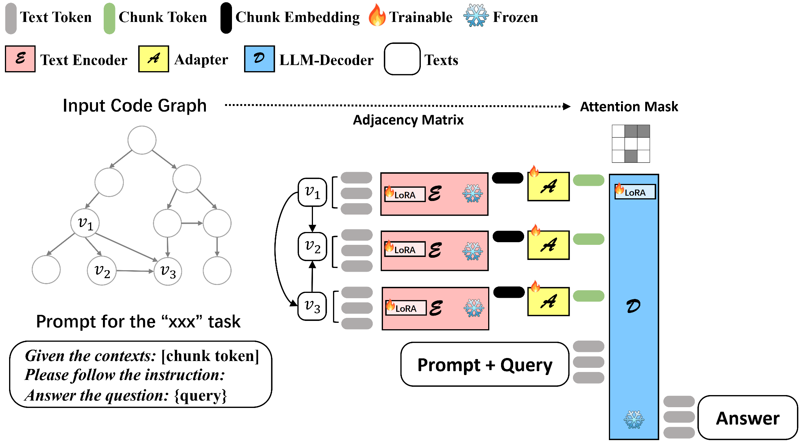

# CGM: Code Graph LLM


## Contents
- [News](#news)
- [Introduction](#introduction)
- [Installation](#installation)
- [Usage](#usage)
  - [Rewriter](#rewriter)
  - [Retriever](#retriever)
  - [Reranker](#reranker)
  - [Reader](#reader)
- [Contributing](#contributing)
- [Citation](#citation)
- [Join Us](#join-us)

## News

🔥🔥🔥 [2025/01/15] We are pleased to announce the updated version of the CGM-72B-V1.2. The model further achieves a remarkable 43.00% resolve rate on the SWE-Bench-Lite leaderboard.

🔥🔥🔥 [2024/12/28] We are pleased to announce the updated version of the CGM-72B-V1.1. The model further achieves a remarkable 41.67% resolve rate on the SWE-Bench-Lite leaderboard.

🔥🔥🔥 [2024/10/28] We are pleased to announce that CGM-72B achieves a remarkable 35.67% resolve rate on the SWE-Bench-Lite leaderboard.

🔥🔥🔥 [2024/10/28] We released **CGM**, mainly for repository-level coding tasks.

## Introduction
We propose a graph-based framework CGM for real-world SE tasks. Before CGM starts its work, we construct a repository-level code graph to better represent the repository context and its structure by Code Graph Generator. Inspired by the Retrieval-Augmented Generation (RAG) approach, CGM framework is designed as a chain structure consisting of four atomic nodes, termed as R4 (Rewriter, Retriever, Reranker, and Reader) chain for this scenario. Given an issue, the initial input to the CGM framework includes the issue description and the corresponding code graph. Rewriter will first rewrite the original issue by extracting keywords and generating relevant queries for code graph. Then a heuristic code subgraph is retrieved through Retriever based on the matching anchor nodes from rewriter output. Given that the resulting subgraph provides a relatively broad context necessary for reference, we need a Reranker to identify the files most likely to be modified as a further hint. Subsequently, both the retrieved subgraph and the identified files are input into a trainable, graph-based Reader to generate the corresponding code patch.

### Framework



### Highlights
:white_check_mark: **Code Graph**: Train models on multiple tasks while maintaining a balance between them. The models can even generalize to new, previously unseen tasks.

:white_check_mark: **Multi-framework**: It provides support for both Accelerate (with Deepspeed and FSDP)

:white_check_mark: **Efficient fine-tuning**: It supports LoRA, QLoRA as well as Full-parameters training, enabling fine-tuning of large models with minimal resources. The training speed meets the demands of almost all fine-tuning scenarios.

## Installation
### Prerequisites
- Python 3.8+
- pip

### Required Packages

```bash
transformers==4.46.1
tokenizers==0.20.0
accelerate==1.0.1
peft==0.13.2
jinja2==2.11.3
fuzzywuzzy==0.18.0
python-Levenshtein==0.25.1
networkx==3.0
```

## Usage

### Rewriter
Use function ```generate_prompt_for_extractor``` and ```generate_prompt_for_inferer``` in ```rewriter/prompt.py```
```python
def generate_prompt_for_extractor(problem_statement, repo_name):
    prompt = """
    <issue>
    {}
    </issue> 
    This is an issue related to repository '{}'. 
    Instructions:
    1. Analysis:
    ○ Analyze the provided issue description. Identify the relevant File, Class, or Function involved.
    ○ Determine the specific problem or error encountered and note any clues that may assist in locating the relevant or problematic area.
    2. Extraction:
    ○ After the analysis, extract ALL the mentioned code entities (File, Class, or Function), especially Files.
    ○ Then extract three potential and meaningful keywords, responding in the following format:

    [start_of_analysis] 
    <detailed_analysis> 
    [end_of_analysis] 

    [start_of_related_code_entities] 
    <entity_name_with_path>
    [end_of_related_code_entities] 

    [start_of_related_keywords] 
    <keywords>
    [end_of_related_keywords]

    Notes:
    - Pay attention to the information in the error logs (if exists).
    - The buggy code exists solely in the project described in the issue (e.g., django, sklearn). Buggy location is usually not in the tests files or external packages.
    - Your extracted entities should be CONCISE, ACCURATE and INFORMATIVE.
    - Provide the relative path for code entities if specified (e.g., package/foo.py). Relative path is relative to the repository itself, do not include suffix like '/home/username/', '/etc/service/' or '/tree/master'.
    - Do not include any additional information such as line numbers or explanations in your extraction result.

    Preferred extraction Examples of Code Entities:
    - repo/cart.py
    - Class User()
    - def getData()
    Preferred extraction Examples of Keywords:
    - train_loop
    - hooks
    - docker
    
    Unpreferred extraction Examples of keywords:
    - something wrong
    - input validation
    - TypeError
    """.format(problem_statement, repo_name)
        
    return prompt

def generate_prompt_for_inferer(problem_statement, repo_name):
    prompt = """
    <issue>
    {}
    </issue> 
    This is an issue related to repository '{}'. 
    Task:
    Based on the issue description provided, identify the characteristics of code entities (files, functions, class) that might need to be modified. 
    For each characteristic, generate a search query that could help locate relevant code entities in a codebase.
    Instructions:
    First, analyze the issue description and identify keywords, features, and functionalities that are likely relevant to the modification of code entities.
    Then, create queries that capture these characteristics, focusing on:
    ● File names that may implement relevant functionalities.
    ● Functions or methods that are related to the features described in the issue.
    ● Any patterns or structures that might be relevant to the functionalities mentioned.
    For example:
    ● File related to the initialization of a neural network.
    ● Function related to the training process.
    ● Code used to configure the service.
    Please answer in the following format:

    [start_of_analysis] 
    <detailed_analysis> 
    [end_of_analysis] 

    [start_of_related_queries] 
    query 1:
    query 2:
    ...
    [end_of_related_queries] 

    Notes:
    - Your queries should be DETAILED, ACCURATE and INFORMATIVE. 
    - Your queries should be a complete sentences and do not include additional explanation.
    - The number of queries is up to five, so be focus on the important characteristics.
    - Your queries should focus on the repository code itself, rather than other information like commit history.
    - Pay attention to the information in the error logs (if exists).

    Preferred Query Examples:
    - Look for references to "tqdm" or "progress_bar" within the training loop files to find where progress bars are currently updated.
    - Code snippets where 'gethostbyname' function from 'socket' module is called.
    - File name containing 'mysql.py' AND functions related to 'MySQLStatementSamples' initialization.
    - Functions or methods handling hostname resolution or encoding within 'datadog_checks' directory.
    - Find all occurrences of "early_stopping" within files that also mention "Trainer" to identify where early stopping logic is implemented and potentially needs adjustment for non-default 'val_check_interval'.
    """.format(problem_statement, repo_name)
        
    return prompt
```
You can use the rewriter prompt by
```python
from rewriter.prompt import generate_prompt_for_extractor, generate_prompt_for_inferer

# Generate extraction prompt
extraction_prompt = generate_prompt_for_extractor(problem_statement, repo_name)

# Generate inference prompt
inference_prompt = generate_prompt_for_inferer(problem_statement, repo_name)
```

### Retriever
The Retriever module consists of two main components:

1. ```locate.py``` - Anchor Node Identification
   
Identifies relevant anchor nodes in the code graph based on Rewriter output.

2. ```subgraph.py``` - Relevant Subgraph Extraction

Extracts relevant subgraph around the identified anchor nodes.

### Reranker
Use function ```generate_prompt_for_reranker_stage_1``` and ```generate_prompt_for_reranker_stage_2``` in ```reranker/prompt.py```
```python
"""
Prompt Template for Reranker
"""

reranker_stage_1_system_prompt = """
You are an experienced software developer who specializes in extracting the most relevant files for solving issues from many reference files.

Task:
Based on the information received about the issue from a repository, find the most likely few files from among those that may be able to resolve the issue.

Instructions:
1. Analysis:
- Analyze the provided issue description and files, and pay attention to the relevance of the provided files with the given issue, especially those might be modified during fixing the issue.
- Determine the specific problem or error mentioned in the issue and note any clues that could help your judgment.
2. Extraction:
- Based on your analysis, choose the Top **1** relevant files which might be used in fixing the issue.
- You should choose files from the provided files, and should not modify their name in any way.

Respond in the following format:
[start_of_analysis]
<detailed_analysis> 
[end_of_analysis] 

[start_of_relevant_files] 
1. <file_with_its_path>
2. <file_with_its_path>
3. ...
[end_of_relevant_files] 

Notes:
- You can refer to to the information in the error logs (if exists).
- The relevant file usually exists in the project described in the issue (e.g., django, sklearn). File need modification is usually not in the tests files or external packages.
- The file you choose should be contained in the provided files.
- Provide the file path with files. Do not include redundant suffix like '/home/username/', '/etc/service/' or '/tree/master'.
- Do not include any additional information such as line numbers or explanations in your extraction result.
- Files for initialization and configuration might be modified during changing the code.

Preferred extraction Examples of Related Files:
1. src/utils/file_handler.py
2. core/services/service_manager.py
3. ...
""".strip()

reranker_stage_1_user_prompt_template = """
<repository>
{}
</repository>

<issue>
{}
</issue>
 
<reference_python_file_list>
{}
</reference_python_file_list>

<other_reference_file_list>
{}
</other_reference_file_list>
"""

reranker_stage_2_system_prompt = """
You are an experienced software developer who specializes in assessing the relevance of the file for solving the issue in software repositories.

Task:
For a file provided, evaluate the likelihood that modifying this file would resolve the given issue, and assign a score based on specific criteria.

Instructions:
1. Analysis:
- Analyze the provided issue description and the content of the single relevant file, pay attention to any keywords, error messages, or specific functionalities mentioned that relate to the file.
- Determine how closely the contents and functionality of the file are tied to the problem or error described in the issue.
- Consider the role of the file in the overall project structure (e.g., configuration files, core logic files versus test files, or utility scripts).
2. Scoring:
- Based on your analysis, assign a score from 1 to 5 that represents the relevance of modifying the given file in order to solve the issue.

Score Specifications:
1. **Score 1**: The file is almost certainly unrelated to the issue, with no apparent connection to the functionality or error described in the issue.
2. **Score 2**: The file may be tangentially related, but modifying it is unlikely to resolve the issue directly; possible in rare edge cases.
3. **Score 3**: The file has some relevance to the issue; it might interact with the affected functionality indirectly and tweaking it could be part of a broader fix.
4. **Score 4**: The file is likely related to the issue; it includes code that interacts directly with the functionality in question and could plausibly contain bugs that lead to the issue.
5. **Score 5**: The file is very likely the root cause or heavily involved in the issue and modifying it should directly address the error or problem mentioned.

Respond in the following format:
[start_of_analysis]
<detailed_analysis>
[end_of_analysis]

[start_of_score]
Score <number>
[end_of_score]

Notes:
- The content of the file shows only the structure of this file, including the names of the classes and functions defined in this file.
- You can refer to to the information in the error logs (if exists).
""".strip()

reranker_stage_2_user_prompt_template = """
<repository>
{}
</repository>

<issue>
{}
</issue>

<file_name>
{}
</file_name>

<file_content>
{}
</file_content>
"""

def generate_prompt_for_reranker_stage_1(problem_statement, repo_name, py_file, other_file):
  """
  problem_statement: issue
  repo_name: repo
  py_file: py file list
  other_file: related file list
  """
  return reranker_stage_1_system_prompt, reranker_stage_1_user_prompt_template.format(repo_name, problem_statement, py_file, other_file)

def generate_prompt_for_reranker_stage_2(problem_statement, repo_name, file_name, file_content):
  """
  problem_statement: issue
  repo_name: repo
  file_name: file
  file_content: file content（class xxx和def xxx）
  """
  return reranker_stage_2_system_prompt, reranker_stage_2_user_prompt_template.format(repo_name, problem_statement, file_name, file_content)
```
You can use the reranker prompt by
```python
from reranker.prompt import generate_prompt_for_reranker_stage_1, generate_prompt_for_reranker_stage_2

# Stage 1: Identify relevant files
system_prompt, user_prompt = generate_prompt_for_reranker_stage_1(
    problem_statement, 
    repo_name, 
    py_file_list, 
    other_file_list
)

# Stage 2: Score file relevance
system_prompt, user_prompt = generate_prompt_for_reranker_stage_2(
    problem_statement,
    repo_name,
    target_file,
    file_content
)
```

### Reader
Execute the Reader module with DeepSpeed configurations:
```bash
# Zero-2 Configuration
EXPORT N_NODE={YOUR_MACHINE_NUM} && \
EXPORT N_GPU_PER_NODE={YOUR_GPU_NUM} && \
EXPORT TRAIN_CONFIG={TRAIN_CONFIG}.json && \
bash launch/zero2.sh

# Zero-3 Configuration
EXPORT N_NODE={YOUR_MACHINE_NUM} && \
EXPORT N_GPU_PER_NODE={YOUR_GPU_NUM} && \
EXPORT TRAIN_CONFIG={TRAIN_CONFIG}.json && \
bash launch/zero3.sh
```

## Contributing
Contributions are welcome! If you have any suggestions, ideas, bug reports, or new model/feature supported, please open an issue or submit a pull request.

We welcome contributions from the community! Please follow these guidelines:

1. Fork the repository

2. Create your feature branch

3. Commit your changes

4. Push to the branch

5. Open a Pull Request

For major changes, please open an issue first to discuss the proposed changes.


## Citation
If you find our work useful or helpful for your R&D works, please feel free to cite our paper as below.

## Join-US

We are the AI Native team within the Platform Technology Business Group at Ant Group, dedicated to the intelligentization of Ant Group's platform engineering. Established for over three years, our team has played a pivotal role in supporting the intelligent operation and maintenance of Ant Group's cloud computing infrastructure. Our mission is to build algorithm services and platforms with a wide user base through world-class technological innovation and impact, supporting the implementation of internal and external products and businesses.
Embracing an innovation-driven ethos, our team not only supports business implementation but also propels technological influence. Over the past three years, we have published more than 20 papers at top conferences like ICLR, NeurIPS, KDD, and ACL. Our innovative business outcomes have earned us two Ant Technology's highest T-Star awards and one SuperMA award from Ant Group. Our open-source project CodeFuse has received 4K stars as of February 2024, and our models have been downloaded over 1.5 million times on Huggingface and Modelscope.

We are on the lookout for top talents to join our vibrant team! If you're eager to develop your career in an environment filled with energy, innovation, and a culture of excellence, we welcome you to explore our career opportunities for both campus and experienced hires. Join us and be a part of creating the next milestone in the industry.

**Contact**: hyu.hugo@antgroup.com 
